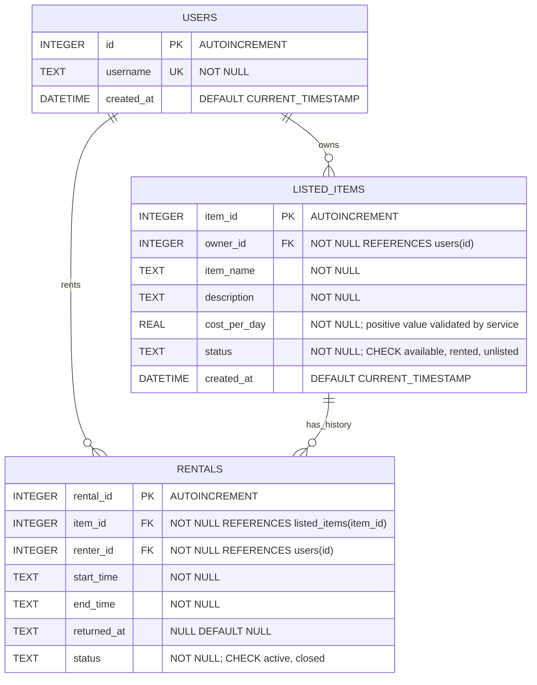

# Rental Tracker ERD

The SQLite schema is defined in `src/main/resources/schema.sql`. Foreign keys are enabled on every JDBC connection. Rental and item rows are retained as history; delisting is represented by the `unlisted` item status rather than deletion.
